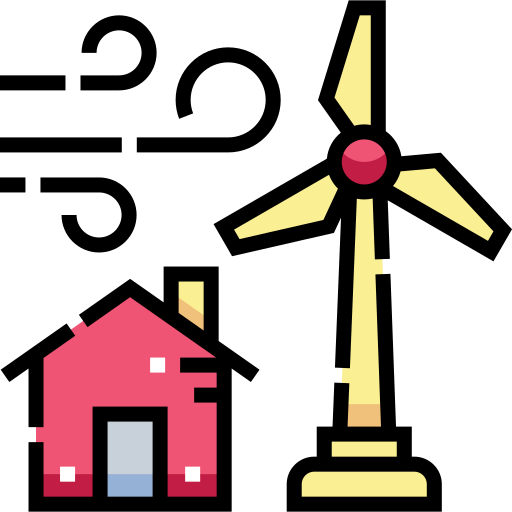

  

# **Power Distrubution Platform**:battery:

Presents a website with a platform solutions for prosumers of electricity production and consumption. 

Displays power on market :electric_plug:, price :moneybag: and current wind speed :dash:. Users can also see specific data about their production and monitor the ratio between buffer and consumption. 

For more information about the system and the provided API see [documentation](https://junkz.github.io/M7011E-DynamicPage/) of the project.

Hosted [here](http://130.240.200.60/). A test admin user is Karla with password '12'

 

