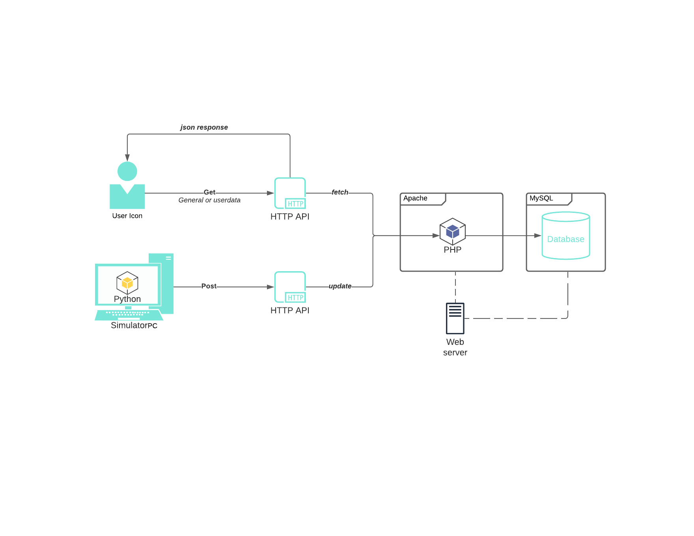

## API Design 

The API is structured to have three interfaces in total, two GET interfaces for regular users and one POST for developers. The two GET interfaces are for anyone who wants to make use of our webservice be it regular users or developers of other systems by retriving relevant general or userdata *see API interfaces*.

The server is ran on Apache2 and uses a singular MySQL database for large time-stamped datasets of buffers, prices and windspeeds.

A simulator is ran on an external host which on a timed regular basis sends updates via the POST interface to the webserver which triggers updates the current buffer size and market price based on wind speed, and the supply and demand of every user on the platform. Since the calculations for the new values happens when the server reacts to an update, no internal program is constantly running on the server and it sole purpose is to host the database and files making up the website.

In a real life situation the data comes from the infrastructure eg. wind turbines, solarceller, coal and oil productions etc. Both from electricity companies but also from the prosumers own productions and facilities. 

The design of our system can be seen in the sketch 

*See [Swagger documentation](https://app.swaggerhub.com/apis/m7011e/m7011e/1.0.0) for avaible interfaces and examples.*